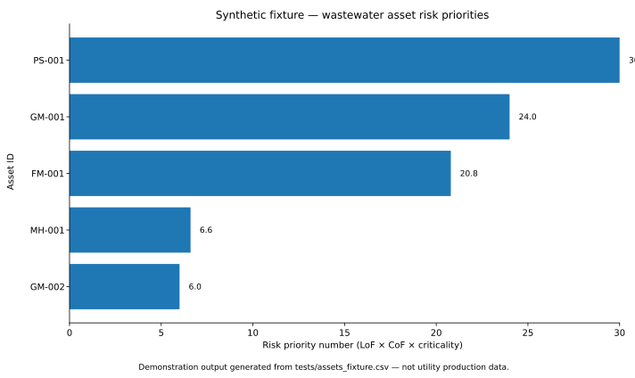
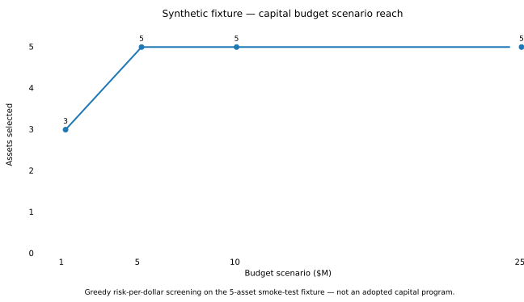

# Wastewater Infrastructure Analytics

**Asset evidence → engineering risk prioritization → rehabilitation strategy → lifecycle economics → capital-allocation screening**

## Project overview

This portfolio project builds a reproducible wastewater infrastructure decision-support pipeline and asks a consulting-style question:

> **Which wastewater assets show the strongest evidence of condition, capacity, failure, and consequence risk; what interventions should be evaluated next; and how should limited capital funding be prioritized?**

The project is structured to move from utility source data to an auditable engineering-priority and capital-planning workflow rather than stopping at a dashboard or one-off notebook.

## Visual proof — synthetic smoke-test fixture

The public repository does not contain utility production data, so the committed visuals below are generated from [`tests/assets_fixture.csv`](tests/assets_fixture.csv). They demonstrate the actual scoring and allocation code paths used by the end-to-end smoke test rather than presenting fabricated utility findings.



**What this shows:** the five-asset fixture is ranked with the project’s transparent `LoF × CoF × criticality` formula. In this demonstration, the pump station and two older conveyance assets rise to the top of the screening queue. These are synthetic test records, not real utility recommendations.



**What this shows:** the configured greedy risk-per-dollar allocator selects three fixture assets under the $1M scenario and all five once the available budget reaches $5M. The flat line at higher budgets reflects the deliberately small five-asset smoke-test dataset, not a real capital-program saturation point.

## Current analytical state

The repository now contains the complete working framework for:

- wastewater asset ingestion and validation
- SQLite-based QA and analytical views
- transparent likelihood-of-failure × consequence-of-failure risk scoring
- configuration-driven priority assumptions
- ranked asset engineering priorities
- planning-level lifecycle cost scenarios
- constrained capital-budget screening
- reproducible figures and compact result extracts
- source/method documentation and reviewer-facing reports
- unit tests plus an end-to-end synthetic CI smoke test

> **Important:** No utility-specific production dataset is committed to this public repository. The current repository demonstrates the analytical and engineering workflow; utility-specific conclusions require validated local data and calibration.

## What I built

### 1. Reproducible wastewater asset pipeline
`src/ingest_assets.py` validates a source asset CSV, preserves asset IDs as text, checks duplicate identifiers and criticality values, writes an analysis-ready extract, and loads an indexed SQLite asset model.

### 2. Auditable SQL quality checks
The `sql/` layer separates data QA and analytical views from Python code:

- `sql/01_quality_checks.sql`
- `sql/02_build_priority_views.sql`

This makes missing LoF/CoF values, invalid score ranges, and the baseline risk calculation directly inspectable.

### 3. Transparent engineering-risk priority

The baseline model is:

```text
Risk Priority Number = Likelihood of Failure × Consequence of Failure × Criticality Multiplier
```

The tested core implementation lives in `src/wastewater_infrastructure_analytics/risk.py`. Engineering assumptions and candidate evidence are documented in `config/priority_score.yaml` rather than hidden in notebook logic.

### 4. Lifecycle economics
`src/lifecycle_cost_model.py` converts planning-level replacement costs into low/base/high present-value scenarios using assumptions in `config/lifecycle_cost_model.yaml`.

The model keeps scenario factors explicit and is intentionally presented as planning-level screening, not a final engineering estimate or bid forecast.

### 5. Capital-allocation screening
`src/capital_allocation.py` tests configured budget scenarios using transparent risk-per-dollar screening. The starter method is deliberately simple so its assumptions remain visible before a more advanced constrained optimization model is introduced.

### 6. Reviewer and evidence layer
The repository includes:

- project charter and project status
- data dictionary and method notes
- codebase/reviewer guide
- current findings and model-readiness reports
- source register for verified external evidence
- case-study evidence framework
- public results/figures structure
- synthetic test fixture and GitHub Actions CI

## Repository structure

```text
.
├── README.md
├── run_pipeline.py
├── requirements.txt
├── pyproject.toml
├── PROJECT_CHARTER.md
├── PROJECT_STATUS.md
├── DATA_DICTIONARY.md
├── METHOD_NOTES.md
├── CODEBASE_GUIDE.md
├── src/                   # Python analytical pipeline + tested risk package
├── sql/                   # QA + priority SQL
├── config/                # priority, cost, screening, and allocation assumptions
├── results/               # compact reviewer-friendly analytical outputs
├── figures/               # reproducible SVG figures
├── reports/               # consulting findings and model documentation
├── sources/               # source/evidence audit trail
├── tests/                 # unit tests + synthetic asset fixture
├── portfolio/             # compact portfolio-facing material
├── notebooks/             # exploratory work only
├── data/
│   ├── raw/               # original local source exports
│   ├── processed/         # normalized analysis-ready extracts
│   └── derived/           # SQLite/intermediate analytical products
└── .github/workflows/     # automated CI
```

## Code

Start with [`CODEBASE_GUIDE.md`](CODEBASE_GUIDE.md) and [`src/README.md`](src/README.md).

Main scripts:

```text
src/ingest_assets.py
src/run_sql.py
src/build_engineering_priority.py
src/lifecycle_cost_model.py
src/capital_allocation.py
src/generate_figures.py
```

Run the pipeline from the repository root:

```bash
python -m venv .venv
source .venv/bin/activate          # Windows: .venv\Scripts\activate
pip install -r requirements.txt
pip install -e .
python run_pipeline.py --project . --input data/raw/assets.csv
```

For development:

```bash
pip install -e ".[dev]"
pytest
```

A synthetic end-to-end example is available through:

```bash
python run_pipeline.py --project . --input tests/assets_fixture.csv
```

GitHub Actions runs the unit tests and this synthetic pipeline on pushes and pull requests.

## Generated deliverables

When a validated asset dataset is connected, the pipeline writes:

- **Full engineering priority:** `results/asset_engineering_priority.csv`
- **Top 25 priorities:** `results/top_25_engineering_priorities.csv`
- **Analysis summary:** `results/analysis_summary.json`
- **Lifecycle scenarios:** `results/lifecycle_cost_scenarios.csv`
- **Capital allocation selections:** `results/capital_allocation_selected_assets.csv`
- **Capital allocation summary:** `results/capital_allocation_summary.csv`
- **Priority figure:** `figures/executive_dashboard.svg`
- **Capital reach figure:** `figures/capital_allocation_portfolio_reach.svg`

## Methods and limitations

The project intentionally separates source observations, data-quality gaps, engineering scoring assumptions, modeled costs, and capital-program recommendations.

Key limitations at the current stage:

- the 1–5 LoF and CoF model requires utility-specific calibration before production use
- no missing inspection or condition record is automatically treated as evidence of good condition
- planning-level cost factors require local bid-history calibration
- hydraulic, structural, environmental, operational, and constructability review remain necessary before project decisions
- sensitive utility data should remain in approved storage rather than this public repository

See [`METHOD_NOTES.md`](METHOD_NOTES.md), [`DATA_DICTIONARY.md`](DATA_DICTIONARY.md), and [`sources/SOURCE_REGISTER.md`](sources/SOURCE_REGISTER.md).

## Quick reviewer path

1. Read this README.
2. Review the two committed demonstration figures above.
3. Open [`CODEBASE_GUIDE.md`](CODEBASE_GUIDE.md).
4. Review [`reports/CURRENT_FINDINGS.md`](reports/CURRENT_FINDINGS.md) and [`PROJECT_STATUS.md`](PROJECT_STATUS.md).
5. Inspect `config/` to see the assumptions outside the code.
6. Inspect `src/` and `sql/` for reproducibility.
7. Review `tests/assets_fixture.csv` and `.github/workflows/ci.yml` for the end-to-end smoke test.
